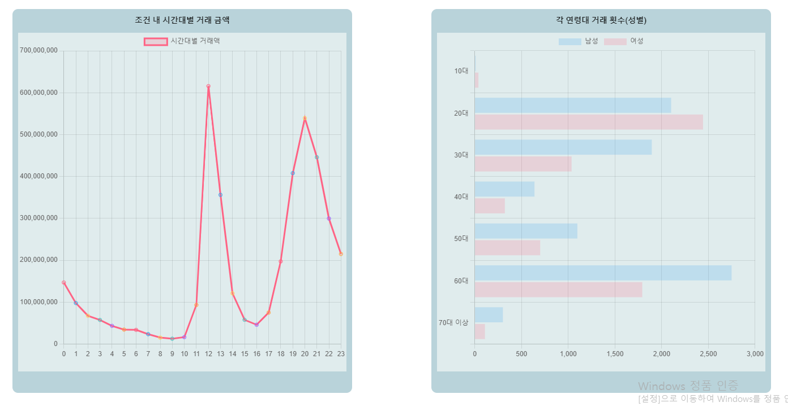
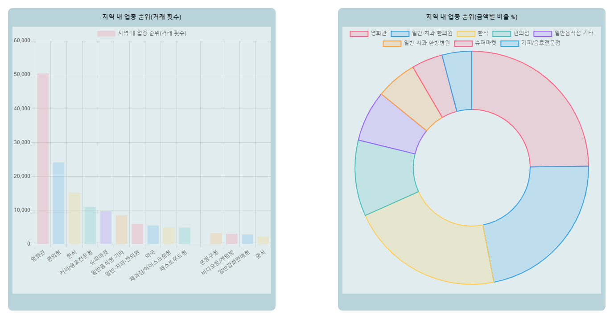
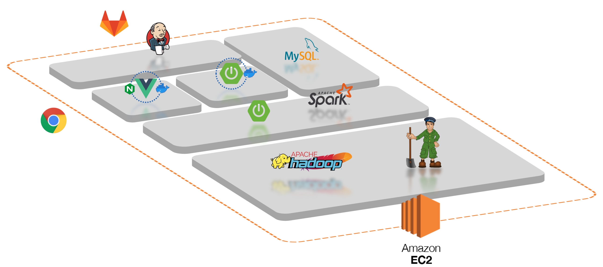

# 창문

- 빅데이터
‘창문’ 프로젝트는 빅데이터 분산 기술을 학습하기 위한 프로젝트입니다. 약 6500만건의 카드거래 데이터를 처리하고 있습니다.
- 창업 의사결정 지원
데이터는 필터와 차트를 이용해 사용자에게 보기쉽게 제공됩니다.
창업을 고려 중인 사용자는 제공된 데이터를 이용해 보다 객관적인 상권 분석을 할 수 있습니다.

# 프로젝트 구조

위와 같은 Hadoop Ecosystem을 구축하였습니다.
분산처리의 핵심인 Hadoop은 2버전을 사용하여 HDFS, MapReduce, Yarn으로 구성됩니다.~

Spark는 MapReduce로 변환해준다.~

Sqoop RDBMS에 있던 데이터를 HDFS에 넣어준다.

# 기술스택
1. hadoop
    - 대량의 데이터를 처리하기 위해 사용
2. spark
    - In-memory 구조로 Map Reduce 작업 속도 증가를 위해 사용
3. zookeeper
    - 노드 간의 동기화 및 상태 관리를 위해 사용
4. sqoop
    - RDB(MySQL)에서 HDFS로 데이터 전송

# 설치

[배포가이드](/exec/포팅메뉴얼.md)

# 팀원소개

🐙조현아(팀장) - Hadoop Ecosystem 구성

💼김현태 - Spark Spring Boot 구성 및 Spark 

👍박성은 - Hadoop - Spark 인프라구성 

🤔박영찬 - DB 구성 및 Spark 

🚗양석조 - Spirng Boot

😎이정현 - 배포, Spring Boot
