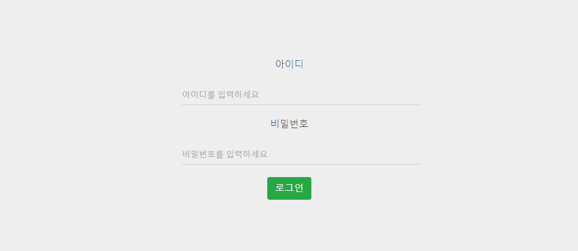

# 시연 시나리오

1. 로그인

네비게이션 바의 로그인 메뉴를 클릭한다.

회원가입했던 아이디, 비밀번호를 입력하여 로그인한다.

1. 통계 데이터 보기

네비게이션 바의 통계 데이터 클릭한다.

검색 조건을 설정하고 검색 버튼을 누른 뒤 잠시 기다린다.

지역 내 업종 순위(거래 횟수), 지역 내 업종 순위(금액별 비율 %), 조건 내 시간대별 거래 금액, 각 연령대 거래 횟수(성별) 데이터 차트를 확인할 수 있다.
